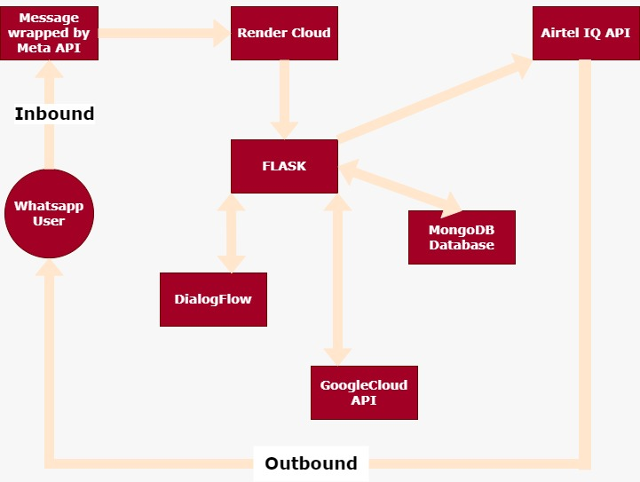
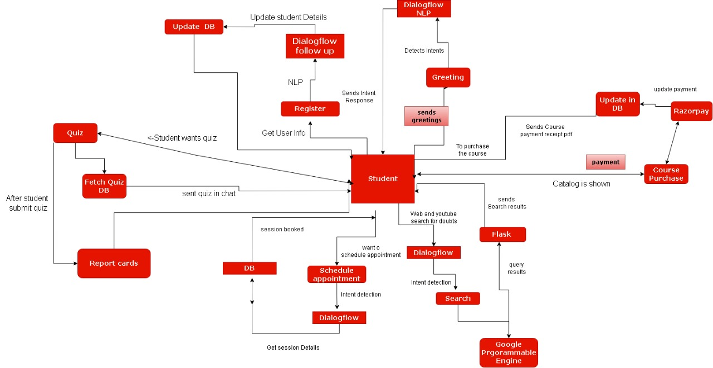

<h1 align="center"> WhatsApp NLP Chatbot </h1>

> ### 🗣 This project is made for Airtel IQ WhatsApp Hackathon under Ed-Tech Use Case on Techgig.

---

> ### 🔈 Implementation Video Link: <a href="https://www.youtube.com/watch?v=sL3P1wua6Ec"> Youtube Video Link </a>

---

## Problem Statement
In the last few years, the Edtech sector has shown massive growth in India. But maximizing the value delivered by online learning platforms necessitates engaging students and parents. This requires providing them with an always-on, secure, easy-to-access, two-way communication platform. However, facilitating the same across all touchpoints throughout the learning process often burdens operational teams with cost-intensive administrative and non-administrative processes.

---

## Our Solution
We have built a chatbot which can be tailored to the organisation’s requirements and service structure.

The chatbot is created to be flexible to the owned organisation. It handles features like registration of the user, querying the organisation’s database, employing natural language processing as required by the end user and many other features which will presented in the following slides.

Our target audience completely depends on the organisations’ brandings. However, the prime target audience can be stated as students. These can be tallied to almost several million users. 

With this chatbot, students can enrol themselves into programs, explore courses and services offered by the organisation, tackle quizzes, be alerted for any promotional activities and use the chatbot as a helping buddy for all educational or organisational information. We have geared our chatbot to use multiple languages and respond to user regarding any query, advertisements, quizzes or other matter in their desired language only.

---

## Features of our System
* User registration
* Payment
* Course catalog
* User portal profile analysis
* Youtube video search service
* Web search service
* Image-to-text search service
* Multi-langauge support
* Course quizzes
* Offers and Incentives in courses
* Progress reports analysis
* Scheduling and rescheduling appointments
* Organization information (About us)

---

## Tools and Tech Stack Used
* Python Programming Language
* Flask Framework
* Dialogflow ES 
* MongoDB for mock database and storage
* Imgur as a Cloud Bucket for static assets
* Razorpay for payment 
* Airtel IQ CPaas Solution
* Google Programmable Search Engine
* Render to deploy the solution on cloud 
* Facebook Commerce Manager for Catalogue
* WABA NUMBER provided by Airtel IQ

---

## Block Diagram of our System

---

## POC Implementation Diagram of our System

---

## Our Team
<table>
<tr>
<td align="center"><a href="https://github.com/Neel-Dandiwala"><kbd></kbd> <b>Neel Dandiwala</b></a> </td>

<td align="center"><a href="https://github.com/vishalbdange"><kbd></kbd> <b>Vishal Dange</b></a> </td>

<td align="center"><a href="https://github.com/shubhampawar574"><kbd></kbd> <b>Shubham Pawar</b></a> </td>

<td align="center"><a href="https://github.com/OptimalLearner"><kbd></kbd> <b>Keval Dhanani</b></a> </td>
</tr>
</table>